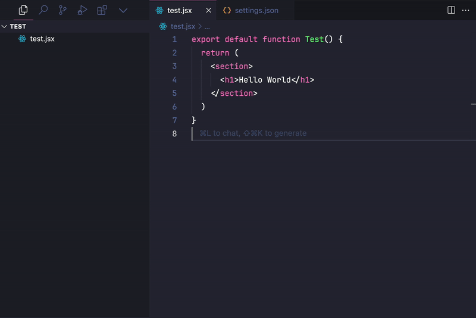

# Create CSS Modules

A VSCode extension that makes it easy to create CSS Modules files.

## ✨ Key Features

- Automatically creates CSS Modules files with the same name as your current file
- Flexible directory configuration for file creation
- Supports various CSS extensions
  - `css`, `scss`, `sass`, `less`, `styl`, `stylus`
- Compatible file formats
  - `js`, `jsx`, `ts`, `tsx`

## ⌨️ Default Keyboard Shortcuts

| Operating System | Shortcut           |
| ---------------- | ------------------ |
| Windows, Linux   | `Ctrl + Shift + M` |
| Mac              | `Cmd + Shift + M`  |

## ⚙️ Configuration

You can configure the following options in VSCode's `settings.json`

```json
{
  "createCSSModules.path": "./styles",
  "createCSSModules.extension": ".scss"
}
```

### Configuration Options

| Option                       | Description                                            | Default |
| ---------------------------- | ------------------------------------------------------ | ------- |
| `createCSSModules.path`      | Directory path where CSS Modules files will be created | `./`    |
| `createCSSModules.extension` | File extension for the generated CSS files             | `css`   |

## 🎥 Usage Example


